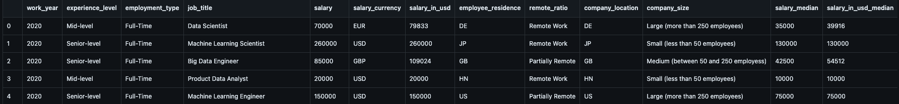

<h1 align="center" id="title">Analysis DataSet Kaggle</h1>

This project involves analyzing a dataset from Kaggle that contains information about employees in the field of data science. The dataset includes details such as years of experience areas of expertise locations and other relevant information. The goal of this project was to thoroughly analyze the data and present it in a clearer and more understandable format making it accessible to those who may not have a background in data science.

<h2>Project Screenshots:</h2>

  
  
<h2>💻 Built with</h2>

Technologies used in the project:

*   Pandas
*   Python
*   Jupyter Notebook
